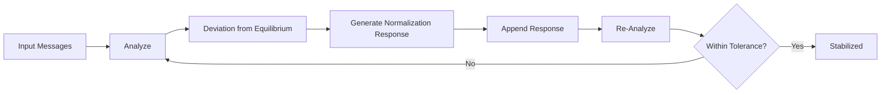

## AI-Powered Temperature Normalization

Thermal Tone can optionally use OpenAI to generate emotionally intelligent, temperature-normalizing responses. This feature is **optional** and only enabled if:

- You set `OPENAI_API_KEY` in a `.env` file (see `.env.example`)
- You pass `{ aiEnabled: true }` in the options

### Enabling AI Mode

1. Copy `.env.example` to `.env` and add your OpenAI API key:
  ```
  OPENAI_API_KEY=sk-...
  ```
2. Pass `aiEnabled: true` in your options:
  ```ts
  const result = await stabilizeConversation(messages, { aiEnabled: true });
  ```
3. If not enabled, the SDK uses deterministic, non-AI normalization.

### API Example with AI

POST `/api` with:
```json
{
  "messages": ["I'm upset!", "Sorry for the trouble."],
  "options": { "aiEnabled": true }
}
```
Returns a stabilization result with AI-generated normalization responses.

# Thermal Tone: Bidirectional Thermal Protocol (BTP)

A TypeScript SDK and Vercel Edge API for conversational emotional stabilization, simulating human-like feedback cycles to guide conversations toward emotional equilibrium.

## Protocol Overview

The Bidirectional Thermal Protocol (BTP) models conversation as a dynamic process:

```
ANALYZE → NORMALIZE → RE-EVALUATE → STABILIZE
```

Each response influences the next, iteratively moving the conversation temperature toward equilibrium (≈36.5–37°C).

## Example Usage (SDK)

```ts
import { stabilizeConversation } from 'thermal-tone';

const messages = [
  "I'm really upset about the delay!",
  "We apologize for the inconvenience."
];

const result = await stabilizeConversation(messages);
console.log(result.finalTemperature); // Should approach equilibrium
```

## Example Usage (API)

POST `/api` with JSON body:

```json
{
  "messages": ["I'm upset!", "Sorry for the trouble."]
}
```

Returns stabilization result.

## Protocol Diagram



## Equilibrium Metaphor

The protocol treats emotional tone as a "temperature." The goal is to gently guide conversations toward a healthy, stable range—never too hot or cold.

**Warning:** This SDK assists communication and moderation. It is not a substitute for professional therapy or crisis intervention.

## Features
- Iterative stabilization cycles
- Adaptive normalization
- Deterministic and AI-driven modes
- Observability hooks for dashboards
- Protocol helpers for session management
- High test coverage
- Deployable as a Vercel Edge API

## Deploy to Vercel

1. Push this repo to your Vercel project.
2. Vercel will auto-detect the `api/` directory and deploy the Edge Function.
3. POST to `/api` with `{ "messages": [...] }` to use the protocol as an API.

## License
MIT
